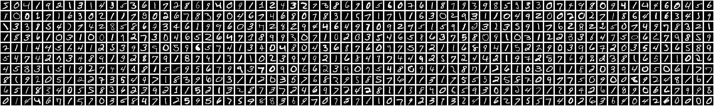
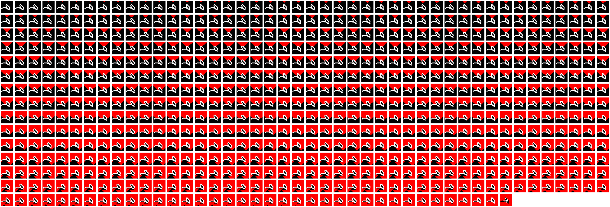

# Visualizing machine learning by classifying number images with a fluid simulation

Jack Crane

---

I saw an incredible video on YouTube about someone who built a computer using just the flow of water[^1], and the creator demonstrated how he set up gates and was able to string them together to form a 4-bit adder. It was an incredible demonstration of the power of simply pouring water and it's natural tendency to flow in all directions but up. This got me thinking about how far we could push water to solve problems. If he was able to create XOR and AND gates, then naturally we could create the other common gates and build a computer that could solve any problem (albeit very slowly). This brought me back to my introduction to Electrical Engineering and Fluid Dynamics courses and it really got me thinking about how almost everything in Fluid Dynamics and Thermodynamics are just re-phrasings of electrical engineering problems. Insulators are just resistors, flow is just a current, and so on. I began seriously thinking about how I could create a more significant computer using water, and using what I know about fluid dynamics and electrical/computer engineering, I began to think about how I could build a larger system. The more I thought about it, however, the reality of being a college student without access to enough room, time, resources, or energy to build a project like this began to set in. While up late studying for my Calculus III and Fluid Dynamics final exams, it hit me that fluid flows around different objects differently, and if I could simulate the fluid flow around an object, I could find a way to store information about the simulation and use some vector nearness to find the nearset neighbor, and hopefully recognize the object. This essay is the story of how I did that.

Like any good project, the first step was to define the problem. I suppose that this would be some kind of AI classification problem. Although I have never worked with AI and computer vision before, I do know that building a number classifier is a very common first project, so I decided to start with that. I downloaded the MNIST dataset[^2], extracted the images, and then it hit me how insane the project I had taken on was. So I started researching to find if someone had any ideas that I could bounce off of, and found a video [^3] of someone doing almost exactly what I was trying to do.

*Figure 1: A sample of the MNIST dataset.*

After processing in the images, I began processing the data. I had to find a way to represent the image data in a way that I could convert into an n-dimensional vector. I began thinking about how, given (for example) the number `3`, pouring water over the top would allow all the water to flow downwards and none would be captured. However if I rotated it 90 degrees clockwise, the water (pouring from the new top) would be captured in the curved bit of the 3. If I recorded how much water was captured in each orientation, I could use that to create a vector to group common features together.

The more I considered it, I began to realize a the issues I would have distinguishing between numbers like `6` and `9`, seeing that they have similar features in different orientations and areas. After watching [^3], I realized that if I could break the retained and blocked water into 8 regions: the left and right halves of the original, 90 degrees clockwise, 180 degrees, and 270 degrees, I would be able to embed not only the presence of features but also the general position of said features.

*Figure 2: Frames of a fluind simulation pouring over the number `9`.*

After a great deal of messing around, I was able to convert numbers in different orientations to 2 numbers, representing the number of filled pixels in the left and right halves of the image. Using the core idea that water is able to flow down, left, and right, and is not able to flow up or through barriers, I generated a vector that represented the presence of the number in each orientation.

<table>
<tr>
<td>
90 degrees

316, 354

</td>
<td>

</td>
<td>

</td>
</tr>
<tr>
<td>
180 degrees

334, 324

</td>
<td>

</td>
<td>

</td>
</tr>
<tr>
<td>
270 degrees

354, 298

</td>
<td>

</td>
<td>

</td>
</tr>
</table>

If you observe the frames or watch a video of the simulation [^4], you will notice that the simulated fluid's flow is remarkably similar to the behavior of a breadth-first search algorithm. Fluid does not flow in a way that is consistent with either a depth-first or breadth-first search, but in an open control volume, it tends to expand in all directions with a consistent velocity, leading to a similar flow pattern to a breadth-first search.

Given the flow patterns above, we can construct a 9-dimensional vector that represents the total number of fluid pixels, followed by the number of filled pixels on both halves of each of the four orientations.

$$
\langle
\color{forestgreen}670
\color{white},
\color{yellow}336
\color{white},
\color{yellow}342
\color{white},
\color{orange}316
\color{white},
\color{orange}354
\color{white},
\color{teal}334
\color{white},
\color{teal}324
\color{white},
\color{red}354
\color{white},
\color{red}298
\color{white}
\rangle
$$

I then ran the "training" script which calculates this vector for each image in the dataset, and got over 60,000 vectors. While it is a 9-dimensional vector, we can reduce it to a 3d graph by picking 3 components to plot. For the sake of this article, I plotted the left halves of 180 degree and 90 degree turned images, and the right half of the 180 degree image.

*Figure 3: A 3d scatter plot of the MNIST dataset having been processed with the fluid simulation.*

Looking at this scatter plot, we can see how different characters are grouped together. For example, the cluster of lime green downward facing triangles is a huge collection of `4` characters.

There are some disparities in the distribution of some of these samples, for example the `1` character is in a very tight cluster with other `1` characters since there are not that many ways to draw a 1. `7`, on the other hand has two distinct clusters along the bottom, which is an indicator of the differences between how the the character can be drawn, with one band being a normal `7`, and the other being a `7` with a diagonal line through it.

*Figure 4: A 3d scatter plot of the MNIST dataset having been processed with the fluid simulation, connecting some of the `7` datapoints to the images that created them.*

From our 9-dimensional point cloud, the last step is to identify the closest neighbor to a new, unseen number. We can do this using the Euclidian Distance formula of an n-dimensional vector:

$$
\sqrt{(x_1 - x_2)^2 + (y_1 - y_2)^2 + (z_1 - z_2)^2 + \cdots + (*_1 - *_1)^2}
$$

Now, given a new, unseen image of a number (in the correct format), we can extract features from it, evaluate them, and connect them to other similar characters in the dataset. There are far more efficient and accurate ways to do fluid simulations using deep neural networks, but using such a tangible approach to the problem was extremely interesting to me and I wanted to share it.

[^1]: https://www.youtube.com/watch?v=IxXaizglscw. Accessed 2-19-2024.
[^2]: https://www.kaggle.com/datasets/hojjatk/mnist-dataset. Accessed 2-19-2024.
[^3]: https://youtu.be/CC4G_xKK2g8. Accessed 2-19-2024.
[^4]: https://jack-general.nyc3.digitaloceanspaces.com/floodfill-limited-270.mp4. Accessed 2-19-2024.