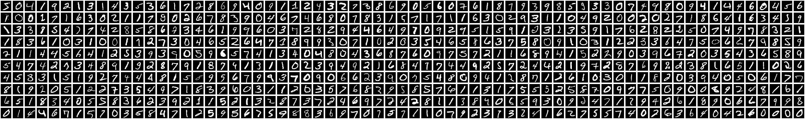
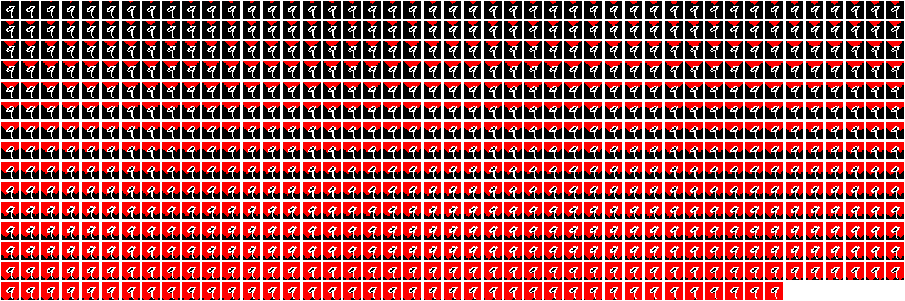
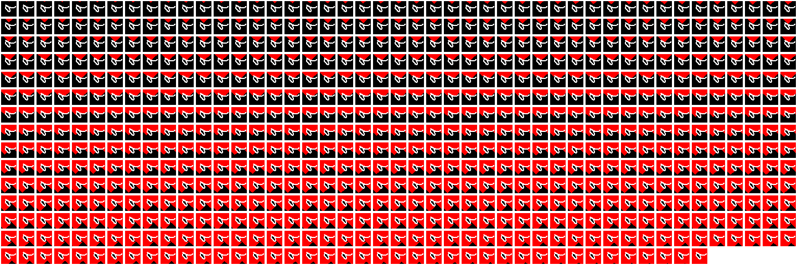
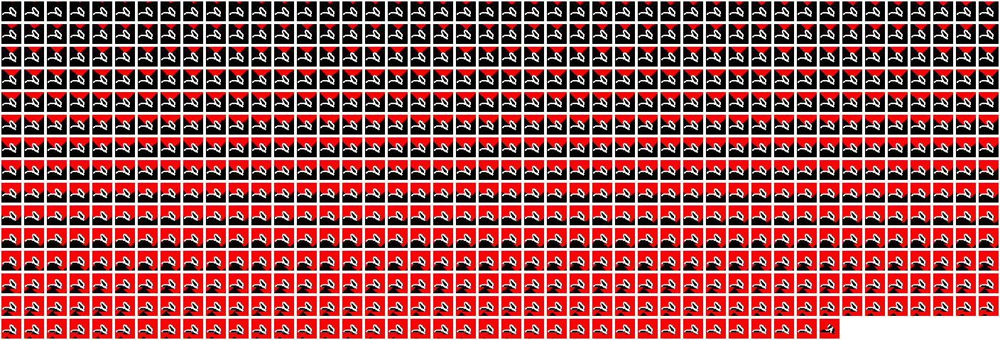

# Fluid Number Classification


> Heavily inspired by the video [Can Water Recognize Numbers? | KNN Digit Recognizer](https://youtu.be/CC4G_xKK2g8?si=6xTBuhwJq0d2OTho) by PickentCode.

This project is my first legit adventure into machine learning and computer vision. I wanted to do it right and learn starting at the ground floor before getting into frameworks like TensorFlow. I understand the equivalent of the "hello world" project in machine learning is to classify a handwritten digit, so I downloaded the MNIST dataset and got started.

Here is the journey.

<!--  -->

## Section 0: improving rendering of this readme

Run the following code in your browser console on this page to improve the rendering of a few images.

```js
['ffl0f', 'ffl90f', 'ffl180f', 'ffl270f'].map(id => {
  const img = document.querySelector(`#user-content-${id}`);
  img.style.maxWidth = "200px";
  img.style.imageRendering = "pixelated";
})
```

## Getting Started: Aquiring and ingesting the Data

I downloaded the MNIST dataset from Kaggle and extracted the images and labels. This left me with 4 files:

```bash
% tree
.
├── t10k-images.idx3-ubyte
├── t10k-labels.idx1-ubyte
├── train-images.idx3-ubyte
└── train-labels.idx1-ubyte
```

Then I created the [`src/load.js`](./src/load.js) file to convert the files from their binary format into javascript friendly data. The output of this function looks like:

```json
[
  {
    '2': [
      0, 0, 0, 0, 0, 0, 0, 0, 0, 0, 0, 0,
      0, 0, 0, 0, 0, 0, 0, 0, 0, 0, 0, 0,
      0, 0, 0, 0, 0, 0, 0, 0, 0, 0, 0, 0,
      0, 0, 0, 0, 0, 0, 0, 0, 0, 0, 0, 0,
      0, 0, 0, 0, 0, 0, 0, 0, 0, 0, 0, 0,
      0, 0, 0, 0, 0, 0, 0, 0, 0, 0, 0, 0,
      0, 0, 0, 0, 0, 0, 0, 0, 0, 0, 0, 0,
      0, 0, 0, 0, 0, 0, 0, 0, 0, 0, 0, 0,
      0, 0, 0, 0,
      ... 684 more items
    ]
  },
]
```

Each pixel value falls between [0, 255]. This left me with a very long 1x784 array. I reshaped this array into a 28x28 array of pixels in the [`src/reshapeArray.js`](./src/reshapeArray.js) file.

At this point, I was able to load the data and parse it into images.

<!-- 67x10 grid of images -->



## Flood Filling

The next step was to implement a flood fill algorithm. Originally I wrote a depth-first ff algorithm, but switched to breadth-first because it would generate a better looking result animation. This [algorithm](./src/floodFillLetter.js) is nothing novel so it is linked and won't be further covered.

https://github.com/user-attachments/assets/6880634a-8c8e-4883-816c-4d9743ee2098

Next, we need to find out how many pixels are filled in as "liquid". This will be one of the inputs to our final vector. This image (number `4` in the mnist dataset) has 670 pixels filled in this test. Our final vector is now:

$$
\langle
\color{forestgreen}670
\color{white},
\color{yellow}?
\color{white},
\color{yellow}?
\color{white},
\color{orange}?
\color{white},
\color{orange}?
\color{white},
\color{teal}?
\color{white},
\color{teal}?
\color{white},
\color{red}?
\color{white},
\color{red}?
\color{white}
\rangle
$$

## Limited Flood Fill

We will now use a limited flood fill algorithm to simulate pouring liquid into the image from the top. Basically we will restrict the fluid from traveling upwards, then we will run the same flood fill algorithm as before. Then, we will rotate the image 90 degrees and repeat the process. Rotate it again, and repeat. We will capture the result of the 4 orientations, and serve them as inputs to our final vector. Additionally, to account for the fact that some numbers will have an unbalanced distribution of filled pixels (think a 6 rotated 90 degrees counter clockwise will catch a lot of liquid in the curved bit) we are splitting the number of filled pixels down the middle:

```js
const numFilledPixelsFirstHalf = flooded.reduce(
  (acc, arr) => acc + arr.slice(0, Math.floor(arr.length / 2)).filter((x) => x).length,
  0
);

const numFilledPixelsSecondHalf = flooded.reduce(
  (acc, arr) => acc + arr.slice(Math.floor(arr.length / 2)).filter((x) => x).length,
  0
);
```

Starting with the original orientation, when we restrict the floodfill from traversing upward, we get only 2 pixels that don't get filled in:

<table>
<tr>
<td>



</td>
<td>


</td>
</tr>
</table>

so the total is 668 (326 + 342), so we will add to our vector:

$$
\langle
\color{forestgreen}670
\color{white},
\color{yellow}336
\color{white},
\color{yellow}342
\color{white},
\color{orange}?
\color{white},
\color{orange}?
\color{white},
\color{teal}?
\color{white},
\color{teal}?
\color{white},
\color{red}?
\color{white},
\color{red}?
\color{white}
\rangle
$$

<table>
<tr>
<td>
90 degrees

316, 354

</td>
<td>



</td>
<td>


</td>
</tr>
<tr>
<td>
180 degrees

334, 324

</td>
<td>


</td>
<td>


</td>
</tr>
<tr>
<td>
270 degrees

354, 298

</td>
<td>



</td>
<td>


</td>
</tr>
</table>

Finally, this heeds our final vector for this sample:

$$
\langle
\color{forestgreen}670
\color{white},
\color{yellow}336
\color{white},
\color{yellow}342
\color{white},
\color{orange}316
\color{white},
\color{orange}354
\color{white},
\color{teal}334
\color{white},
\color{teal}324
\color{white},
\color{red}354
\color{white},
\color{red}298
\color{white}
\rangle
$$