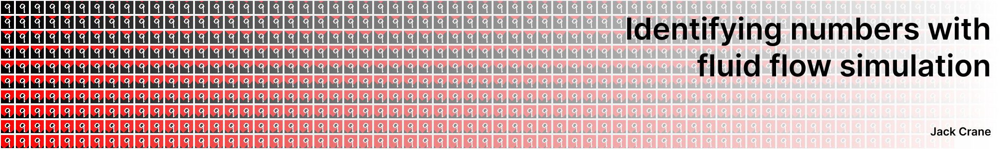

# Fluid Number Classification



> Heavily inspired by the video [Can Water Recognize Numbers? | KNN Digit Recognizer](https://youtu.be/CC4G_xKK2g8?si=6xTBuhwJq0d2OTho) by PickentCode.

This project is my first legit adventure into machine learning and computer vision. I wanted to do it right and learn starting at the ground floor before getting into frameworks like TensorFlow. I understand the equivalent of the "hello world" project in machine learning is to classify a handwritten digit, so I downloaded the MNIST dataset and got started.

Here is the journey.

## Getting Started: Aquiring and ingesting the Data

I downloaded the MNIST dataset from Kaggle and extracted the images and labels. This left me with 4 files:

```bash
% tree
.
├── t10k-images.idx3-ubyte
├── t10k-labels.idx1-ubyte
├── train-images.idx3-ubyte
└── train-labels.idx1-ubyte
```

Then I created the [`src/load.js`](./src/load.js) file to convert the files from their binary format into javascript friendly data. The output of this function looks like:

```json
[
  {
    '2': [
      0, 0, 0, 0, 0, 0, 0, 0, 0, 0, 0, 0,
      0, 0, 0, 0, 0, 0, 0, 0, 0, 0, 0, 0,
      0, 0, 0, 0, 0, 0, 0, 0, 0, 0, 0, 0,
      0, 0, 0, 0, 0, 0, 0, 0, 0, 0, 0, 0,
      0, 0, 0, 0, 0, 0, 0, 0, 0, 0, 0, 0,
      0, 0, 0, 0, 0, 0, 0, 0, 0, 0, 0, 0,
      0, 0, 0, 0, 0, 0, 0, 0, 0, 0, 0, 0,
      0, 0, 0, 0, 0, 0, 0, 0, 0, 0, 0, 0,
      0, 0, 0, 0,
      ... 684 more items
    ]
  },
]
```

Each pixel value falls between [0, 255]. This left me with a very long 1x784 array. I reshaped this array into a 28x28 array of pixels in the [`src/reshapeArray.js`](./src/reshapeArray.js) file.